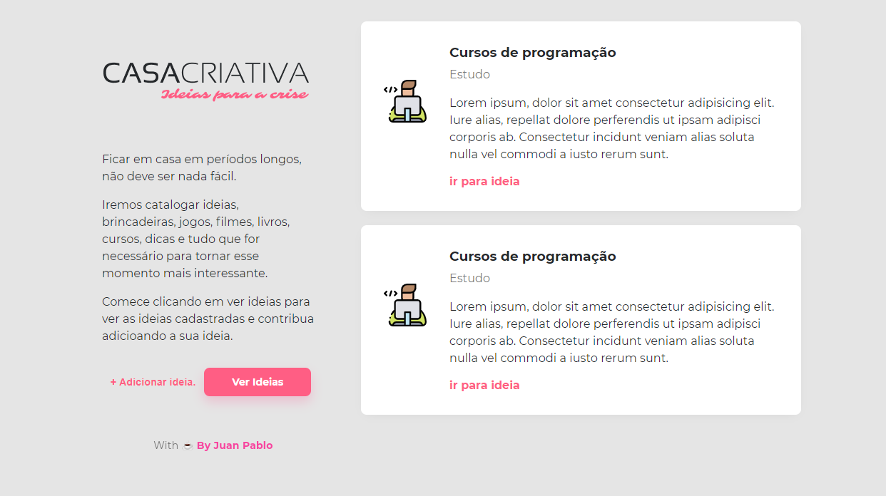
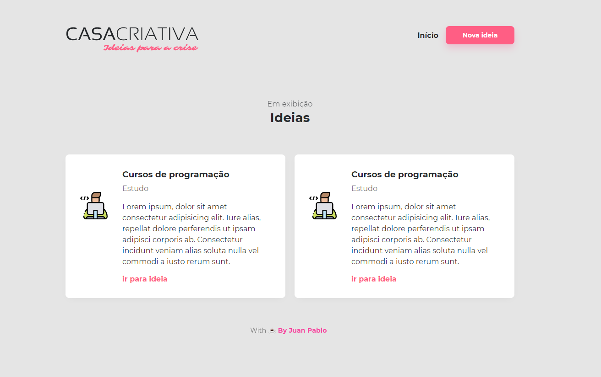
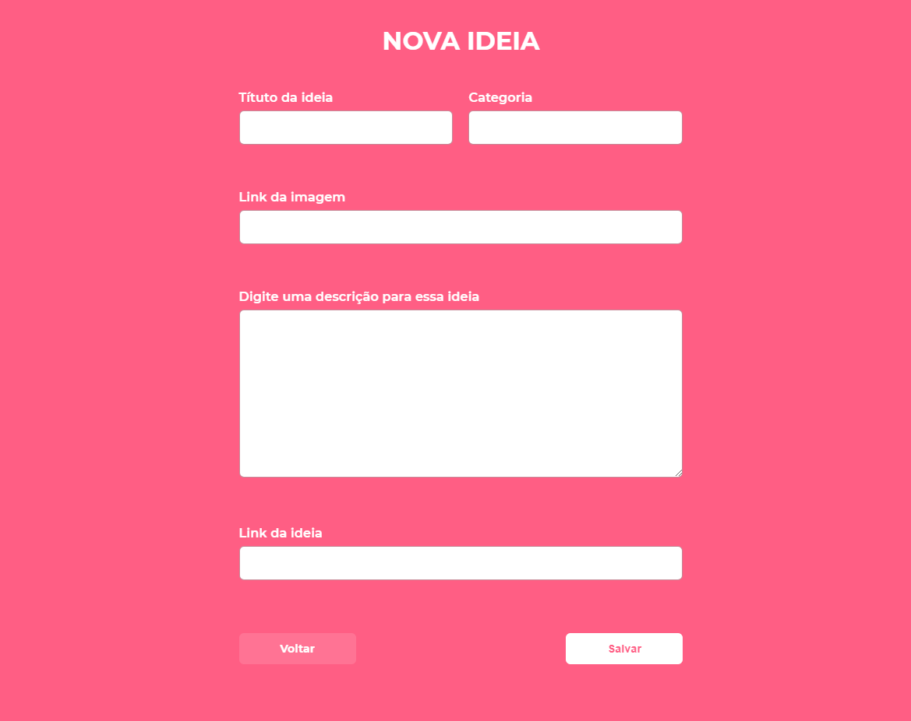

<h1 align="center">
  
    <br>
</h1>

<h4 align="center">
  A application to add some ideas that you thought into the lockdown of the pandemic
</h4>


## :rocket: Built with

This project was developed with the following technologies:

-  [Node.js](https://nodejs.org/)
-  [Express](https://expressjs.com/)
-  [sqlite3](https://sqlitebrowser.org/)
-  [nunjucks](https://www.npmjs.com/package/nunjucks)
-  [VS Code](https://code.visualstudio.com/)

## :information_source: How to run

### Requirements
To run the app, you will need [Git](https://git-scm.com), [Node.js](https://nodejs.org/) v12.18.1 or higher, [Npm](https://www.npmjs.com/), [SQLite3](https://sqlitebrowser.org/).
<br>

### Application
Now clone the repository and install the dependencies.
```bash
# to clone the repository
git clone https://github.com/JuanPablo192/Casa_Criativa.git

# go into the folder
cd Casa_Criativa/

#install the backend dependencies
npm install

```

# run application
```bash
npm run dev
```




## :page_facing_up: License

This project is under the MIT license.

## :mailbox_with_mail: Get in touch!

[ LinkedIn ](https://www.linkedin.com/in/juanpablodev/)

---

Made with :coffee: and ♥ by Juan Pablo.
